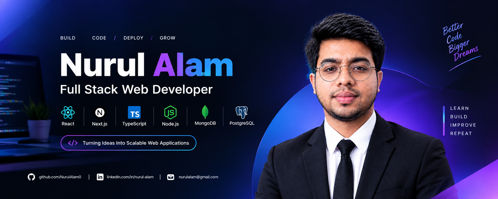

 

<h1>Hi 👋, I'm Nurul Alam</h1>

<h3>Full Stack Web Developer from Bangladesh 🇧🇩</h3>

  Building modern, scalable and user-focused web applications.

  
 
  

---

## 👨‍💻 About Me

- 🌱 Currently learning **Next.js, TypeScript, Node.js & Backend Development**
- 💻 Focused on **Full Stack Web Development**
- 💬 Ask me about **JavaScript, React, Web Development, Git & GitHub**
- 📫 Email: **md2023siyam@gmail.com**
- ⚡ Fun fact: **I love turning ideas into real-world applications**

## 🛠️ Languages & Tools

### 💻 Frontend

  

### ⚙️ Backend

  

### 🗄️ Database

  

### 🔧 Tools

  

---

## 📚 Currently Learning

  

- Next.js
- TypeScript
- Node.js
- Backend Development
- REST API Development
- Authentication & Authorization

---

## 🎯 Goals

- 🚀 Become a professional **Full Stack Developer**
- 🧠 Improve **Data Structures & Algorithms**
- ⚙️ Build production-ready web applications
- 🔐 Improve backend security and authentication
- ☁️ Learn modern deployment and cloud technologies
- 🤖 Explore AI integration in web applications
- 💼 Start my professional career in software development

---

## 📊 GitHub Statistics

  

---

## 🤝 Connect With Me

---

### 💻 Build • Learn • Improve • Repeat

⭐ Thanks for visiting my profile!

